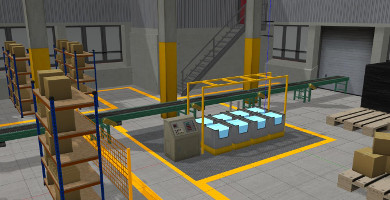

# The conveyor_gazebo Package

A Gazebo simulation of a conveyor belt.  

**Disclaimer**  
This package contains the conveyor belt model and plugin that is part of the 
greater GEAR (Gazebo Environment for Agile Robotics) ROS package developed by the Open Source Robotics Foundation. GEAR is the software used by teams participating in the Agile Robotics for Industrial Automation Competition (ARIAC) hosted by the National Institute of Standards and Technology (NIST).
The link to the original source code for the version of GEAR used in ARIAC 2017 is [here.](https://bitbucket.org/osrf/ariac/commits/branch/ariac_2017).



Figure 1. Gazebo Simulation for the ARIAC Competition. [Source.](http://gazebosim.org/ariac)

### Requirements

+ Ubuntu 16.04 LTS
+ ROS Kinetic
+ Gazebo 7.0

### Installation

Clone this to your local development environment:
```
$ cd catkin_ws/src
$ git clone https://github.com/rfzeg/conveyor_gazebo.git
```

Once a local copy has been created it is neccesary to run the following commands:
```
$ cd catkin_ws
$ catkin_make
$ source devel/setup.bash
$ roslaunch conveyor_gazebo demo.launch
```

Note: The simulation starts paused.

A simulation environment as the one shown below should appear in Gazebo:


### Activate the conveyor

On another terminal run this command to see the available services:

`$ rosservice list`

From the results you obtained it is possible to observe that there is a conveyor/control service available.
The conveyor belt can be controlled by sending service calls to this service.

For instance:

`$ rosservice call /conveyor/control "state: power: 30.0"`

It is recomended to start typing the command above and press the Tab key until the message auto-completes.  If the auto-complete does not work, source your workspace and try again.

The "power" can range from 0.0 to 100.0. Use 0.0 to stop the conveyor

Rememeber to unpause the simulation for the conveyor belt to start moving.

This package has only been tested on Ubuntu 16.04 LTS with ROS Kinetic and Gazebo 7.0.

### Project Extensions
There are many exciting possible extensions to this project:
+ Add fix that enables placing/spawning the conveyor anywhere in the simulated world. 
+ Avoid that objects protrude from the conveyor belt. Decrease the size of the collision box dynamically as it moves forward.
+ Implement reverse running of conveyor belt.

